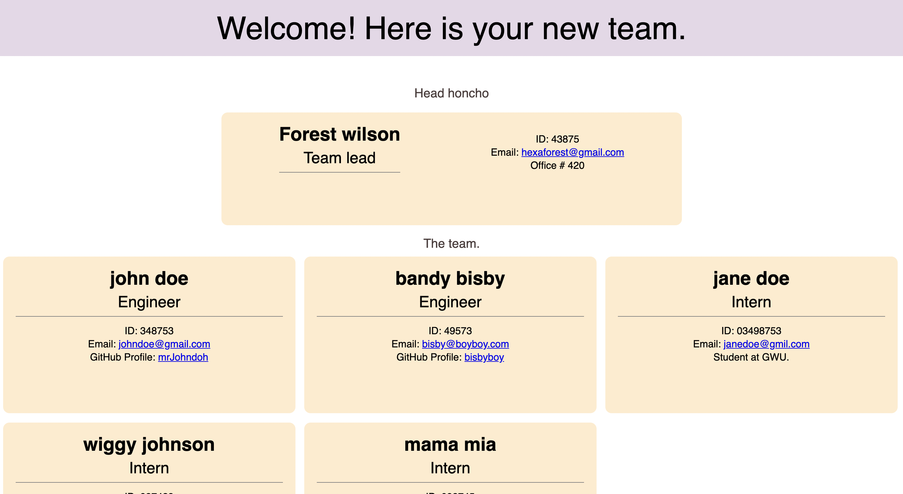

# Forest Wilson - hw10teamprofilegenerator

### About This Project
* # Project description:
  Welcome to this team profile generator for you to log your own and your teams information and create an html page that shows your entire team's information. After initialization, you will be prompted to enter your info, and then you may add as many engineers or interns as youd like. once you are finished adding your team, you will be asked to pick your color theme, and then an html page will be created to display your new team.
  
* # Project installation
  1. npm i
  2. npm run test
  3. npm run start

* # Additional comments
  - I appologize for the long demo video, didnt expect the email window to pop up tandem-page :/

  - In the dist folder, there will be two page examples.

  - Instead of comments on all of the classes and tests, I have commented on the mgmt portions of both. comments carry over.

  - No src folder, was unsure what that was for.

###### Questions or concerns? 
* Please contact me at one of the following!
  Email - hexaforest@gmail.com
  gitHub - https://github.com/ForestW70/

# Extras
* Screenshots:
  
  
* Demo:
  [App demo](https://youtu.be/q5OVMxwlkuU)

* Links:
  [Repo page](https://github.com/ForestW70/hw10teamprofilegenerator)
  

